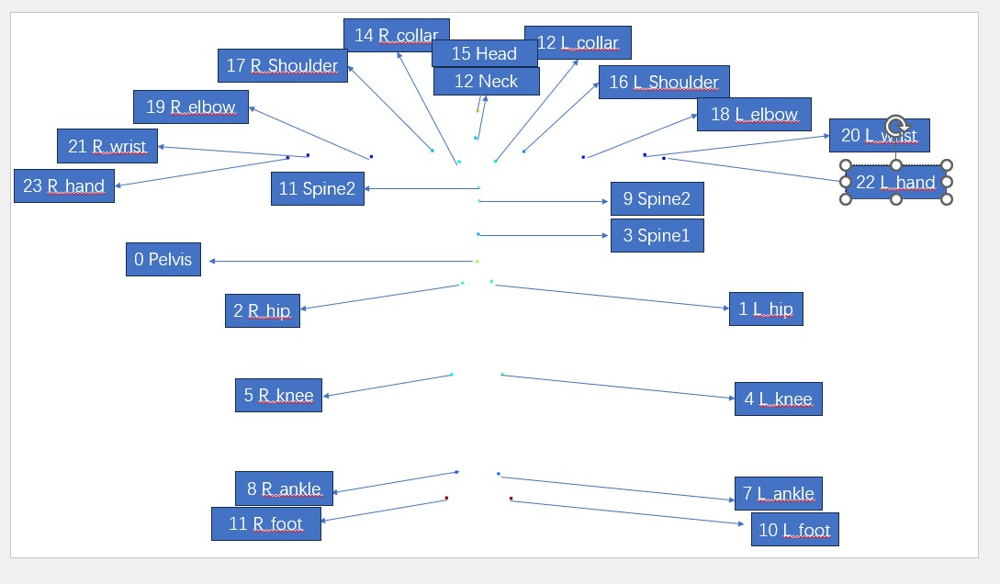

## Visualization
- This repository is mainly based on open3d

### Dataformat
shown in data
```
this is the name of this array: person_idx, this is the shape of that array ()
this is the name of this array: mrkconfig_idx, this is the shape of that array ()
this is the name of this array: M, this is the shape of that array (4510, 56, 3)
this is the name of this array: M1, this is the shape of that array (4510, 56, 3)
this is the name of this array: J_t, this is the shape of that array (4510, 24, 3)
this is the name of this array: J_R, this is the shape of that array (4510, 24, 3, 3)
this is the name of this array: shape, this is the shape of that array (1, 10)
this is the name of this array: J, this is the shape of that array (24, 3)
this is the name of this array: Marker, this is the shape of that array (56, 3)
this is the name of this array: weights, this is the shape of that array (56, 24)
```

### Skeleton Picture


